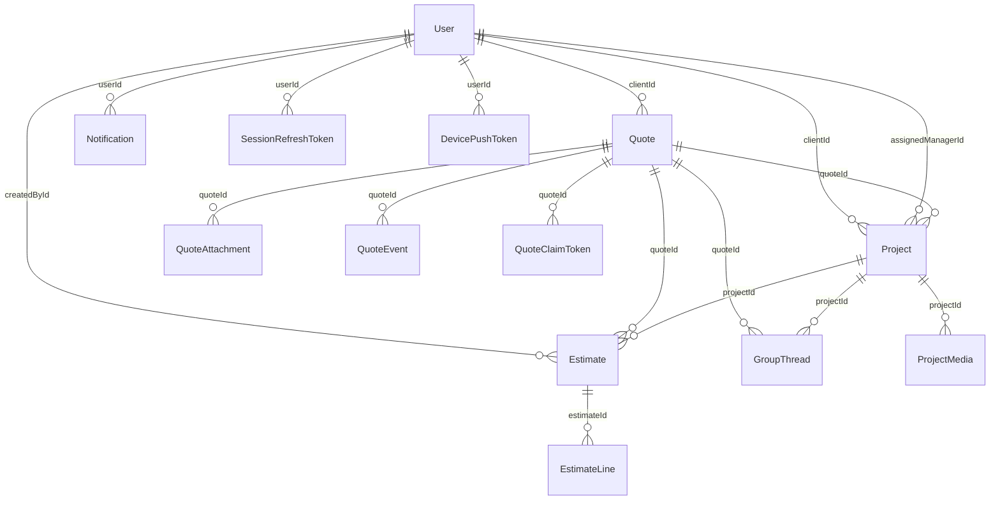

# Level Lines - Architektura Techniczna

## Cel dokumentu

Ten dokument opisuje techniczną budowę systemu: runtime, warstwy frontendowe, backend, API, modele danych, sesje, uploady, generator stron, asset pipeline, deploy i fundament Androida.

## 1. Architektura ogólna

```mermaid
flowchart LR
    A[Public HTML pages] --> B[Express app]
    C[Legacy dashboards] --> B
    D[web-v2 /app-v2] --> E[api/v2]
    F[mobile-client] --> E
    G[mobile-company] --> E
    B --> H[Legacy routes]
    E --> I[Sequelize models]
    H --> I
    I --> J[(Postgres)]
    B --> K[/uploads]
    B --> L[Generated public pages]
    L --> M[Asset manifest + optimized media]
```

## 2. Runtime HTTP

### 2.1 `server.js`

`server.js`:

- ładuje konfigurację środowiskową,
- waliduje wymagane env vars (`DATABASE_URL`, `JWT_SECRET`, `BOOTSTRAP_ADMIN_KEY`),
- uruchamia `createApp()` z `app.js`,
- binduje HTTP pod `HOST` i `PORT`.

Domyślnie runtime działa pod `127.0.0.1:3000`, a reverse proxy/Nginx kieruje publiczny ruch do tego procesu.

### 2.2 `app.js`

`app.js` jest głównym montażem Expressa.

Obsługuje:

- security middleware (`helmet`, `cors`, limity),
- `GET /healthz`,
- legacy auth/routes,
- `api/v2`,
- public/contact/gallery routes,
- mount buildu `apps/web-v2` pod `/app-v2`,
- static serving plików publicznych i uploadów.

Najważniejsze mount points:

| Mount | Co obsługuje |
| --- | --- |
| `/api/auth` | legacy auth |
| `/api/quotes` | legacy public quote flow |
| `/api/inbox` | legacy direct inbox |
| `/api/manager` | legacy manager operations |
| `/api/client` | legacy client operations |
| `/api/v2` | nowy kontrakt API |
| `/api/gallery` | public gallery APIs |
| `/api/contact` | public contact form |
| `/uploads` | publiczny dostęp do plików uploadowanych przez system |
| `/app-v2` | nowa aplikacja webowa |

## 3. Podział frontendów

### 3.1 Public HTML

Pliki w katalogu głównym są nadal realną warstwą produkcyjną:

- `index.html`
- `about.html`
- `services.html`
- `gallery.html`
- `quote.html`
- `contact.html`
- legal pages
- generated SEO pages

Warstwa ta używa głównie:

- `site.js`
- `runtime.js`
- `quote.js`
- `gallery.js`
- `brand.js`
- `styles/public.css`, `styles/base.css`, `styles/tokens.css`

### 3.2 Legacy auth/workspace

Legacy dashboardy nadal działają jako kompatybilna warstwa operacyjna:

- `auth.html`
- `client-dashboard.html`
- `manager-dashboard.html`

W praktyce:

- `auth.html` to most między publicznym webem a zalogowanym kontem,
- `client-dashboard.html` i `manager-dashboard.html` nadal obsługują część realnych workflow,
- ale strategiczny kierunek auth web to `web-v2`.

### 3.3 `web-v2`

`apps/web-v2` to Reactowa aplikacja auth-aware.

Jej cechy:

- korzysta z `api/v2`,
- ma role-aware shell,
- jest przygotowana do bycia docelowym authenticated web,
- używa wspólnych kontraktów z `shared/contracts/v2.js`.

### 3.4 Android

Android jest rozdzielony na dwa shelle:

- `apps/mobile-client`
- `apps/mobile-company`

Obie aplikacje są oparte o:

- `packages/mobile-core`
- `packages/mobile-ui`
- `packages/mobile-contracts`

czyli architektonicznie od początku przygotowane pod wspólny backend i wspólne domeny.

## 4. API - legacy vs v2

### 4.1 Legacy API

Legacy API istnieje głównie po to, żeby utrzymać działanie starszych stron HTML i dashboardów.

Najważniejsze grupy:

| Grupa | Przykładowe ścieżki | Cel |
| --- | --- | --- |
| Auth | `/api/auth/*` | legacy login/session/account |
| Quotes | `/api/quotes/*` | guest quote submit, preview, claim |
| Inbox | `/api/inbox/*` | direct messaging |
| Manager | `/api/manager/*` | zarządzanie quotes, projects, stock, people |
| Client | `/api/client/*` | legacy klient workspace |
| Gallery / public | `/api/gallery/*`, `/api/contact` | public forms i galeria |

### 4.2 API v2

`api/v2` to główny nowoczesny kontrakt dla:

- `web-v2`,
- Androida,
- części publicznych flow.

Standard odpowiedzi:

- sukces: `{ data, meta }`
- błąd: `{ error: { code, message, details? } }`

Główne route groups:

| Route group | Co obsługuje |
| --- | --- |
| `/api/v2/auth` | login, register, refresh, logout, me, profile, password |
| `/api/v2/devices` | push token registration |
| `/api/v2/overview` | role-aware dashboard summary |
| `/api/v2/quotes` | quote lifecycle dla auth users |
| `/api/v2/public/quotes` | public quote contract dla submit/preview/claim/follow-up |
| `/api/v2/projects` | projekty i lifecycle delivery |
| `/api/v2/messages` | direct/project communication |
| `/api/v2/notifications` | powiadomienia |
| `/api/v2/crm` | lifecycle i klient/staff context |
| `/api/v2/inventory` | materials/services operational data |
| `/api/v2/activity` | activity/audit feed |
| `/api/v2/services`, `/api/v2/gallery/services` | public catalog/gallery data |

Ważna uwaga: `api/v2/public/quotes` nadal deleguje do legacy guest routera jako adapter. To jest warstwa przejściowa, a nie jeszcze całkowicie niezależna implementacja.

## 5. Auth i sesje

### 5.1 Model sesji

System ma most między starszą warstwą auth a `api/v2`.

W browser storage istnieją klucze:

| Klucz | Znaczenie |
| --- | --- |
| `ll_auth_token` | legacy access token |
| `ll_auth_user` | zapisany user summary |
| `ll_v2_access_token` | access token dla `api/v2` |
| `ll_v2_refresh_token` | refresh token dla `api/v2` |

`site.js`, `runtime.js` i `auth.js` dbają o:

- zapis sesji po loginie,
- odczyt sesji z `localStorage`,
- próbę odświeżenia sesji przez `api/v2/auth/refresh`,
- uniknięcie natychmiastowego logoutu, jeśli legacy token wygasł, ale refresh token jest ważny.

### 5.2 `api/v2/auth`

`api/v2/auth` daje:

- `POST /register`
- `POST /login`
- `POST /refresh`
- `POST /logout`
- `GET /me`
- `PATCH /profile`
- `PATCH /password`

Po loginie / refreshie backend zwraca:

- `accessToken`
- `refreshToken`
- `legacyToken`
- `user`

czyli jednocześnie karmi nowy i stary shell.

## 6. Modele danych i relacje

### 6.1 Główne modele

| Model | Rola |
| --- | --- |
| `User` | klient albo staff (`client`, `employee`, `manager`, `admin`) |
| `Quote` | intake i operacyjny rekord zapytania |
| `QuoteAttachment` | zdjęcia i pliki quote |
| `QuoteEvent` | timeline zdarzeń quote |
| `QuoteClaimToken` | kody i tokeny claimowania guest quote |
| `Estimate` | oferta handlowa, wersjonowana |
| `EstimateLine` | pozycje estimate |
| `Project` | projekt delivery |
| `ProjectMedia` | obrazy i dokumenty projektu |
| `InboxThread`, `InboxMessage` | private inbox |
| `GroupThread`, `GroupMember`, `GroupMessage` | project/group chat |
| `Notification` | alerty użytkownika |
| `ActivityEvent` | activity/audit feed |
| `ServiceOffering` | usługi publiczne / ofertowe |
| `Material` | materiały i stock |
| `SessionRefreshToken` | trwała sesja refresh |
| `DevicePushToken` | urządzenie i push ownership |

### 6.2 Najważniejsze relacje



### 6.3 Quote -> estimate -> project

`Quote` ma dwa poziomy statusów:

- legacy `status`: `pending`, `in_progress`, `responded`, `closed`
- nowy `workflowStatus`:
  - `submitted`
  - `triaged`
  - `assigned`
  - `awaiting_client_info`
  - `estimate_in_progress`
  - `estimate_sent`
  - `client_review`
  - `approved_ready_for_project`
  - `converted_to_project`
  - `closed_lost`

`Estimate` ma:

- `status`: `draft`, `sent`, `approved`, `archived`, `superseded`
- `decisionStatus`: `pending`, `viewed`, `revision_requested`, `accepted`, `declined`
- `versionNumber`
- `isCurrentVersion`

`Project` ma:

- `status`: `planning`, `in_progress`, `completed`, `on_hold`
- `projectStage`:
  - `briefing`
  - `scope_locked`
  - `procurement`
  - `site_prep`
  - `installation`
  - `finishing`
  - `handover`
  - `aftercare`

## 7. Quotes i publiczny intake

Publiczny intake jest jednym z najważniejszych elementów systemu.

### 7.1 Co zapisuje quote

`Quote` przechowuje między innymi:

- klienta lub guest identity,
- `projectType`,
- `location`, `postcode`,
- `budgetRange`,
- `proposalDetails` jako strukturalne metadata z formularza,
- `description` jako czytelny tekst operacyjny,
- `priority`,
- `workflowStatus`,
- follow-up fields: `nextActionAt`, `responseDeadline`, `lossReason`.

### 7.2 Załączniki

Załączniki quote:

- trafiają do upload storage,
- są zapisywane w `QuoteAttachment`,
- są używane w publicznym preview, manager review, client follow-up i mobilnych flow.

### 7.3 Claim flow

Claim flow działa tak:

1. Guest wysyła quote.
2. System tworzy `publicToken`.
3. Użytkownik widzi private preview link.
4. Z private preview wysyła request o claim code.
5. Kod idzie email albo phone webhookiem.
6. Użytkownik loguje się albo rejestruje.
7. Potwierdza claim i quote zostaje przypisane do konta.

## 8. Messaging

System ma dwa typy komunikacji:

| Typ | Model | Do czego służy |
| --- | --- | --- |
| Private inbox | `InboxThread`, `InboxMessage` | wiadomości bezpośrednie między użytkownikami |
| Project / group chat | `GroupThread`, `GroupMember`, `GroupMessage` | komunikacja w kontekście projektu lub quote |

To rozdzielenie jest ważne:

- private inbox to relacja user <-> user,
- group/project chat to relacja wokół obiektu pracy.

## 9. Overview, notifications i activity

### 9.1 `GET /api/v2/overview`

Overview to agregowany payload dla dashboardów.

Zawiera w zależności od roli:

- recent projects,
- recent quotes,
- counts aktywnych projektów i open quotes,
- unread notifications,
- inbox/thread counts,
- low-stock signals,
- client/staff counts dla staff roles.

### 9.2 Notifications

`Notification` przechowuje indywidualne alerty użytkownika.

Use cases:

- new quote,
- assignment,
- revision request,
- approval,
- project update,
- message alert.

### 9.3 Activity feed

`ActivityEvent` to trwały feed aktywności powiązany z:

- klientem,
- quote,
- projektem,
- aktorem.

To jest warstwa, która łączy CRM i audit trail.

## 10. Publiczne treści, generator i asset pipeline

### 10.1 Generator publicznych stron

Repo ma generator stron service/location.

Najważniejsze elementy:

- `scripts/publicPageRenderer.js`
- `scripts/publicPages.shared.js`
- `scripts/generate-service-pages.js`
- `scripts/generate-location-pages.js`

Generator buduje:

- HTML,
- meta,
- JSON-LD,
- CTA,
- internal linking,
- shared shell.

### 10.2 Asset pipeline

System używa:

- `asset-manifest.js`
- `scripts/optimize-assets.js`
- `assets/optimized`
- `Gallery`

Brand i gallery assets dostają zoptymalizowane warianty AVIF/WebP/fallback.

### 10.3 Gallery source-of-truth

Publiczna galeria jest folder-driven.

Znaczy to, że:

- foldery w `Gallery/<service>/...` są źródłem prawdy dla folder-backed gallery,
- usługi i obrazy są sortowane deterministycznie,
- `api/gallery/services` i powiązane widoki korzystają z tego modelu.

## 11. Deploy i runtime operations

### 11.1 Flow deployu

Repo zakłada jawny deploy flow:

1. `npm ci`
2. `npm run migrate`
3. opcjonalnie `npm run ensure:indexes`
4. `pm2 restart ... --update-env`

Migracje nie odpalają się już automatycznie przy każdym boocie aplikacji.

### 11.2 Pliki deployowe

| Plik | Rola |
| --- | --- |
| `ecosystem.config.js` | konfiguracja PM2 |
| `deploy/setup-droplet.sh` | bootstrap serwera |
| `deploy/harden-droplet.sh` | hardening |
| `deploy/CUTOVER_CHECKLIST_STAGING_PROD_v2.md` | checklista rollout/cutover |
| `deploy/LOCAL_POSTGRES_COMPOSE_BOOTSTRAP.md` | lokalny Postgres bootstrap |
| `deploy/docker-compose.local-db.yml` | lokalny DB compose |

### 11.3 Health checks

| Endpoint | Cel |
| --- | --- |
| `/healthz` | podstawowy process-level HTTP health check |
| `/api/v2/health` | health check warstwy v2 |

## 12. Android foundations

### 12.1 Mobile shared core

`packages/mobile-core` daje:

- auth/session helpers,
- mobile API client,
- quote defaults,
- multipart upload builder,
- push registration payload builder,
- polling helpers.

### 12.2 Mobile UI

`packages/mobile-ui` daje wspólne komponenty:

- `AppScreen`
- `SectionCard`
- `InputField`
- `ActionButton`
- `TabBar`
- `Notice`
- `MetricGrid`
- `ListCard`
- `EmptyState`
- `ChoiceChipGroup`

### 12.3 Mobile contracts

`packages/mobile-contracts` opierają się o `shared/contracts/v2.js` i zawierają:

- `MobileSession`
- app variants `client` / `company`
- route enums dla obu aplikacji,
- walidację payloadów mobilnych,
- role gating per app variant.

### 12.4 Push

`POST /api/v2/devices/push-token` zapisuje:

- `platform`
- `provider`
- `appVariant`
- `pushToken`
- `deviceId`
- `deviceName`
- `appVersion`

To jest fundament pod rozdzielenie push ownership dla client app i company app.

## 13. Najważniejsze zasady architektoniczne repo

1. Publiczny web i auth shell nadal żyją obok nowej warstwy `web-v2`.
2. `api/v2` jest głównym kierunkiem kontraktów dla przyszłych klientów web/mobile.
3. Legacy routes są nadal ważne, bo część live flow wciąż od nich zależy.
4. Quote flow jest centrum systemu: od leadu do projektu.
5. Android został podzielony na dwa osobne produkty, ale na wspólnym core.
6. Projekt jest już przygotowany tak, żeby rozwijać web i mobile bez pełnego przepisywania domen.

## 14. Co jest najważniejsze dla nowego developera

Jeśli ktoś wchodzi do repo po raz pierwszy, powinien czytać system w tej kolejności:

1. `README.md`
2. `Docs/Level Lines - System Overview.md`
3. `Docs/Level Lines - Mapa Strony I Ekranow.md`
4. `Docs/Level Lines - Architektura Techniczna.md`
5. `app.js` i `api/v2/index.js`
6. `models/index.js`
7. `shared/contracts/v2.js`
8. dopiero potem konkretne frontend surface'y:
   - public HTML,
   - legacy dashboards,
   - `apps/web-v2`,
   - `apps/mobile-client`,
   - `apps/mobile-company`.

To daje najszybszą drogę do zrozumienia, gdzie kończy się brochure, gdzie zaczyna workflow operacyjny i które warstwy są dziś strategiczne dla dalszego rozwoju.
