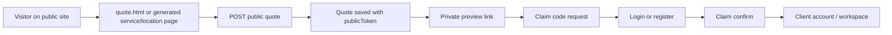
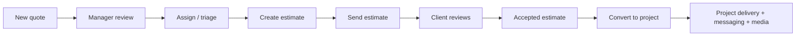
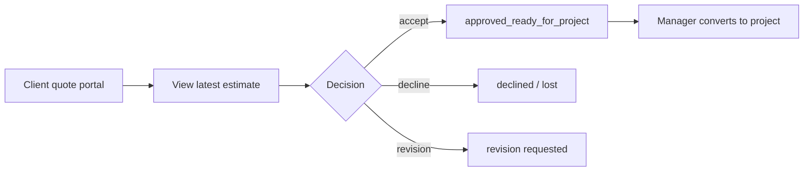

# Level Lines - System Overview

## Cel dokumentu

Ten dokument opisuje produkt na poziomie biznesowo-systemowym: jakie ma powierzchnie, dla kogo są przeznaczone, jak wyglądają główne przepływy użytkowników i które części są już live, a które są jeszcze warstwą przejściową albo fundamentem pod kolejne rollouty.

## 1. Czym jest ten system

Level Lines to jeden wspólny system dla:

- publicznej strony firmy i jej stron SEO,
- publicznego przyjmowania zapytań ofertowych (`quote`),
- claimowania i dalszej obsługi quote przez klienta,
- pracy operacyjnej firmy: quotes, estimates, projects, inbox, CRM, stock, services,
- nowej warstwy aplikacyjnej `web-v2`,
- dwóch osobnych aplikacji Android:
  - `mobile-client` dla klienta,
  - `mobile-company` dla staffu / managera / admina.

To nie jest więc tylko brochure website. To jest połączony system: marketing + intake + CRM + quoting + project delivery + komunikacja.

## 2. Główne powierzchnie produktu

| Powierzchnia | Gdzie jest | Dla kogo | Rola |
| --- | --- | --- | --- |
| Public site | pliki HTML w katalogu głównym, np. `index.html`, `services.html`, `quote.html` | odwiedzający, potencjalni klienci | prezentacja marki, oferty, galerii, wejście do quote flow |
| Generated SEO pages | pliki HTML generowane przez skrypty, np. `premium-bathrooms-manchester.html` | ruch organiczny, użytkownik z wyszukiwarki | przechwycenie intencji lokalnej/usługowej i skierowanie do quote |
| Legacy auth/account | `auth.html`, `auth.js` | klient, staff, manager, admin | logowanie, rejestracja, konto, claim handoff |
| Legacy client workspace | `client-dashboard.html` + moduły | klient | przegląd projektów, wiadomości, overview |
| Legacy manager workspace | `manager-dashboard.html` + moduły | employee, manager, admin | operacyjny panel firmy |
| `web-v2` | `apps/web-v2`, mount pod `/app-v2` | klient, staff, manager, admin | docelowa nowa warstwa aplikacyjna dla auth users |
| Android client app | `apps/mobile-client` | klient | quote, claim, projekty, wiadomości, powiadomienia |
| Android company app | `apps/mobile-company` | employee, manager, admin | operacyjne zarządzanie firmą z telefonu |
| API v2 | `api/v2/*` | `web-v2`, mobile, część public flows | główny nowoczesny kontrakt danych |
| Legacy API | `routes/*`, `/api/*`, `/api/manager/*`, `/api/auth/*` | legacy HTML pages | kompatybilność i starsze flow |

## 3. Role użytkowników

| Rola | Gdzie głównie działa | Co obsługuje |
| --- | --- | --- |
| Guest visitor | public site | przegląd strony, wysłanie publicznego quote |
| Claimed / logged client | `auth.html`, `client-dashboard.html`, `web-v2`, `mobile-client` | własne quotes, estimate review, projekty, wiadomości, konto |
| Employee | legacy manager workspace, `web-v2`, `mobile-company` | projekty, czat, powiadomienia, część operacji firmowych |
| Manager | legacy manager workspace, `web-v2`, `mobile-company` | quotes, estimates, projekty, CRM, stock, część content/service ops |
| Admin | jak manager + więcej uprawnień | pełna kontrola nad systemem i użytkownikami |

## 4. Najważniejsze domeny biznesowe

| Domena | Do czego służy | Główne modele |
| --- | --- | --- |
| Auth / Session | logowanie, utrzymanie sesji, odświeżanie tokenów | `User`, `SessionRefreshToken` |
| Quotes | intake i obsługa zapytań klientów | `Quote`, `QuoteAttachment`, `QuoteEvent`, `QuoteClaimToken` |
| Estimates | wersjonowane oferty handlowe do quote lub projektu | `Estimate`, `EstimateLine` |
| Projects | realizacja po akceptacji oferty | `Project`, `ProjectMedia` |
| Messaging | komunikacja prywatna i projektowa | `InboxThread`, `InboxMessage`, `GroupThread`, `GroupMember`, `GroupMessage` |
| CRM | lifecycle klienta i kontekst relacji | `User`, `ActivityEvent` |
| Notifications | alerty i stan unread | `Notification`, `DevicePushToken` |
| Services / Website | oferta publiczna i treści serwisu | `ServiceOffering`, generator publicznych stron |
| Stock / Materials | magazyn, dostawcy, stany minimalne | `Material` |

## 5. Główne przepływy użytkowników

### 5.1 Odwiedzający -> quote -> claim -> klient

### 5.2 Manager -> quote -> estimate -> project

### 5.3 Klient -> estimate -> approval -> project

## 6. Co jest live, a co jest transitional

| Obszar | Status | Znaczenie |
| --- | --- | --- |
| Public brochure pages | `live` | to jest realna frontowa warstwa marketingowa serwisu |
| Public quote flow | `live` | działa, przyjmuje zdjęcia, prywatny preview link i claim flow |
| `auth.html` | `live + transitional` | aktywny punkt logowania i claim handoff, ale nie docelowy UX dla wszystkich auth flows |
| `client-dashboard.html` | `transitional` | działa, ale docelowo część funkcji ma przenieść się do `web-v2` |
| `manager-dashboard.html` | `transitional` | nadal ważny operacyjnie, ale rozwój systemu równolegle idzie w `web-v2` |
| `web-v2` | `live rollout target` | nowa docelowa warstwa auth web |
| `mobile-client` | `foundation` | przygotowany szkielet i logika pod klienta |
| `mobile-company` | `foundation` | przygotowany szkielet i logika pod firmę |
| `mobile-v1` | `prototype / seed` | historyczny prototyp, nie docelowa aplikacja |

## 7. Z czego system bierze dane

| Warstwa | Źródło danych |
| --- | --- |
| Public brochure HTML | ręczne pliki + generator publicznych stron |
| Generated service/location pages | skrypty `scripts/generate-*` i wspólne dane rendererów |
| Public quote / preview / claim | legacy quote router + `api/v2/public/quotes` adapter |
| Legacy dashboards | legacy REST endpoints i część współdzielonych helperów |
| `web-v2` | `api/v2` |
| Android apps | `api/v2` + shared mobile core/contracts |
| Galerie i brand media | `asset-manifest.js`, `Gallery`, `assets/optimized`, folder-driven gallery helpers |

## 8. Co jest najważniejszym source of truth

| Obszar | Source of truth |
| --- | --- |
| Runtime HTTP app | `app.js` |
| Serwer startowy | `server.js` |
| Nowy kontrakt danych | `api/v2/*` + `shared/contracts/v2.js` |
| Relacje modeli | `models/index.js` |
| Public brand shell | `brand.js`, `Current_Web_Design_Source_Of_Truth.md`, `styles/public.css`, `styles/workspace.css` |
| Mobile shared layer | `packages/mobile-core`, `packages/mobile-ui`, `packages/mobile-contracts` |
| Public page generation | `scripts/publicPageRenderer.js` i dane generatorów |

## 9. Jak czytać resztę pakietu dokumentacji

- `Level Lines - Mapa Strony I Ekranow.md` odpowiada na pytanie: co gdzie jest, jaki ekran co pokazuje i jakie akcje obsługuje.
- `Level Lines - Architektura Techniczna.md` odpowiada na pytanie: jak to jest zbudowane, jakie są relacje między warstwami, jak działa auth, API, baza, deploy i Android foundations.

## 10. Najważniejsza intuicja projektowa

Ten system należy czytać jako jedną wspólną platformę, a nie zbiór osobnych stron:

- brochure pages przyciągają ruch,
- public quote flow zbiera lead i kontekst projektu,
- claim flow zamienia guest enquiry w konto klienta,
- estimate workflow zamienia quote w decyzję handlową,
- project workflow prowadzi realizację,
- messaging, CRM, notifications i activity spinają wszystko w jeden ciąg operacyjny,
- `web-v2` i Android mają ten sam docelowy kierunek: współdzielony kontrakt, wspólne domeny i brak potrzeby pełnego rewrite przy kolejnych rolloutach.
