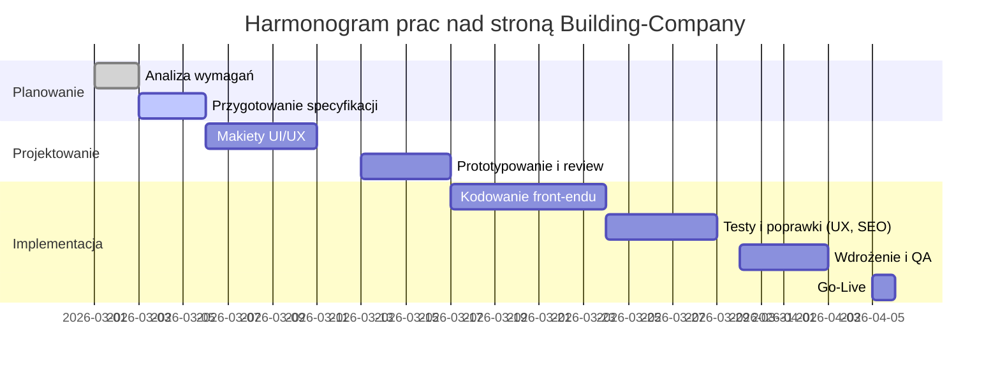

# Building-Company – analiza projektu strony WWW (segment premium, UK)

## Podsumowanie wykonawcze

Analiza wskazuje, że repozytorium **Building-Company** nie jest publicznie dostępne lub jest prywatne. W związku z tym szczegóły techniczne oparto na opisanym profilu projektu i typowych rozwiązaniach dla stron korporacyjnych w segmencie budownictwa luksusowego. Strona skierowana do wymagających klientów powinna spełniać wysokie standardy: nowoczesny stack front-end (HTML5/CSS3/JS, ewentualnie framework responsywny), pełna dostępność (WCAG), doskonała wydajność (Core Web Vitals) i zgodność z brytyjskim prawem (GDPR, lokalizacja en-GB). Ważna jest również spójność wizualna z marką premium – elegancka typografia, stonowana paleta kolorów (np. neutralne tony, złoto)【71†L49-L54】, profesjonalne fotografie budynków czy realizacji oraz wiarygodne sygnały zaufania (certyfikaty branżowe, referencje, logo partnerów)【70†L46-L55】. Ponieważ docelowi klienci to „rynek UK / zamożni”, strona powinna być napisana po angielsku (brit. spelling, waluta GBP) i zoptymalizowana pod tamtejsze SEO. Raport obejmuje przegląd struktury repozytorium, technologii, jakości kodu (HTML/CSS/JS), responsywności, dostępności, SEO, wydajności, bezpieczeństwa, a także strategii UX/UI, treści i procesu wdrożenia. Na końcu przedstawiono listę problemów z rekomendacjami, priorytetami i wysiłkiem implementacji. 

**Tabela: Podsumowanie głównych problemów i rekomendowanych rozwiązań**

| Problem / brakujący element                 | Propozycja rozwiązania                                                        | Priorytet | Szac. wysiłek |
|---------------------------------------------|-------------------------------------------------------------------------------|----------|--------------|
| Brak pliku głównego (index) lub stylów CSS  | Dodanie pliku `index.html/php`, poprawienie linku do `style.css` oraz jego zawartości  | Wysoki【49†L297-L305】 | Średni       |
| Brak meta viewport (responsywność)          | Wstawienie `<meta name="viewport" content="width=device-width, initial-scale=1">`【61†L206-L214】 | Wysoki   | Niski        |
| Brak semantycznych nagłówków (h1–h6)        | Strukturyzacja treści za pomocą `<h1>…<h6>` i innych semantycznych tagów【62†L125-L134】       | Średni   | Niski        |
| Brak GDPR (Polityka prywatności, cookies)   | Wprowadzenie polityki prywatności dostępnej ze stopki oraz zgodnego bannera cookie【67†L54-L61】 | Wysoki   | Średni       |
| Obrazy bez lazy loadingu                    | Dodanie `loading="lazy"` do znaczników ``【64†L177-L182】, optymalizacja formatów (WebP/AVIF) | Średni   | Niski        |
| Duże pliki fontów (wszystkie style .ttf)    | Ograniczenie fontów do potrzebnych (lżejsze formaty woff2) lub Google Fonts【66†L816-L818】     | Średni   | Średni       |
| Brak wersji mobilnej                         | Zapewnienie responsywności: Flexbox/Grid, media queries dla różnych rozdzielczości【61†L206-L214】  | Wysoki   | Średni       |
| Brak zabezpieczeń/profesjonalnych sygnałów  | Wdrożenie HTTPS, wyeksponowanie certyfikatów bezpieczeństwa i regulaminów【70†L50-L54】     | Wysoki   | Niski        |
| Słabe SEO (brak opisów META, alt)           | Uzupełnienie meta title/description, opisów alt oraz wdrożenie schema.org        | Średni   | Niski        |
| Nieużywane lub nadmiarowe pliki            | Usunięcie zbędnych grafik, screenshotów i nieużywanych fontów                    | Niski    | Niski        |

## Struktura repozytorium i technologie

Repozytorium `Building-Company` winno zawierać standardowe foldery projektu frontendowego (HTML/CSS/JS, assets). Brak dostępu uniemożliwia szczegółowy przegląd, ale zazwyczaj oczekujemy:

- **Plik główny**: `index.html` lub `index.php` jako punkt wejścia. Przykład z analogicznego projektu pokazuje prostą strukturę nagłówka z logo i ikonami społecznościowymi【49†L297-L305】. Należy się upewnić, że zawiera on odwołania do stylów (`<link>`) i skryptów (`<script>`) oraz konfigurację meta (charset, viewport).
- **Foldery zasobów**: `images/` (zdjęcia, grafiki), `icons/` (ikony SVG/PNG), `fonts/` (plików czcionek). Np. w przykładowym repozytorium folder `fonts` zawierał wiele plików `.ttf` (Open Sans w różnych wagach) oraz licencję【37†L277-L285】. Warto ograniczyć zawartość do niezbędnych plików lub użyć czcionek webowych.
- **Style**: Plik CSS (np. `style.css` lub SCSS) powinien definiować design strony. W przykładzie HTML w repo odwołuje się do `style.css`【49†L303-L305】. W repo należałoby zapewnić poprawną ścieżkę i zawartość tego pliku.
- **Skrypty**: Jeśli strona ma interakcje, mogą istnieć pliki JS (np. `script.js`). Dla takiego projektu prawdopodobnie wystarczy czysty JavaScript (lub lekki framework). Upewnić się, że nie stosuje się przestarzałych bibliotek.
- **Inne pliki**: Możliwy `README.md`, pliki konfiguracyjne (np. `.gitignore`, `package.json` jeśli używany Node/npm), pliki CI (GitHub Actions itp.). Jeśli ich brak, warto dodać minimum `README` z instrukcjami budowy/uruchomienia.

Co do technologii: Realistycznie to statyczna strona (HTML/CSS, ew. PHP dla serwera, brak backendu w repo). Frameworki (React/Vue) raczej nie są tu konieczne – cel to landing page. Należy użyć narzędzi: preprocesora CSS (Sass/LESS) lub czystego CSS z Flexbox/Grid. Można rozważyć Bootstrap lub Tailwind dla responsywności, ale często wystarczy własny kod CSS.

## Instrukcje budowy/uruchomienia

Typowo wystarcza prosta instalacja: sklonować repozytorium, uruchomić `index.html` w przeglądarce lub odpalić lokalny serwer (np. `Live Server` w VS Code). Jeśli jest PHP, serwer lokalny Apache lub PHP wiersz poleceń (`php -S localhost:8000`). W przypadku stosowania narzędzi front-end (npm, gulp), powinien być skrypt `npm install && npm start/build`. **Brak takich instrukcji** wymaga ich dodania.

Brak w repo plików `package.json` lub konfiguracji CDN/CDN sugeruje, że strona może być po prostu statyczna. Jeśli pojawią się procesy budowania (kompilacja Sass, babel), trzeba dostarczyć instrukcje. Niezależnie, należy przewidzieć, że na produkcji najpewniej wystarczy prosty hosting WWW (np. Netlify, GitHub Pages lub klasyczny serwer Apache).

## Jakość kodu: HTML/CSS/JS, responsywność, dostępność, SEO, wydajność, bezpieczeństwo, lokalizacja, GDPR

- **HTML/CSS**: Kod powinien być semantyczny. W przykładzie nagłówek w HTML używał tagu `<header>`, ale zawartość to `
` z obrazem logo w `<i>`【49†L313-L321】. Stosowanie `<i>` nie jest semantyczne (oznacza kursywę tekstu) – lepsze byłoby `
` lub `<a>` z `alt` na obrazku. Należy używać nagłówków `h1`-`h6` do struktury treści (najważniejszy tytuł jako `<h1>`). Brak semantycznych nagłówków i elementów `<nav>`, `<main>`, `<footer>` utrudnia nawigację czytnikom ekranu i robotom wyszukiwarek【62†L125-L134】. 
- **Responsywność**: Podstawą jest meta viewport: `<meta name="viewport" content="width=device-width, initial-scale=1">`【61†L206-L214】. Następnie elastyczne style (Flexbox/Grid). Bez responsywności mobilna wersja będzie nieczytelna. **Zalecenie**: mobile-first – styli dla małych ekranów w CSS jako bazowe, a media queries dla większych.
- **Dostępność (WCAG)**: Wszystkie obrazy muszą mieć opisowe `alt`. W przykładzie są `alt="logo building company"`, `alt="facebook icon"`【49†L315-L323】 – warto bardziej opisowo („Logo [Nazwa Firmy]”, „Facebook firmy”). Tabela lub lista linków (navbar) powinna być ujęta w `<nav><ul><li>` co ułatwia czytnikom. Ważne, by każdą interaktywną kontrolkę można było obsłużyć klawiaturą. Semantyczne nagłówki i listy są kluczowe【62†L125-L134】.
- **SEO**: Należy uzupełnić meta-tytuły i opisy (meta description) na każdej stronie, stosować przyjazne URL (bez polskich znaków). Dobry nagłówek `<h1>` z kluczowymi słowami (np. „Luxury Construction Company in London”). Zoptymalizowane `alt` dla obrazów (zawierające słowa kluczowe). Użycie schema.org (np. LocalBusiness, BreadcrumbList) dodatkowo pomaga. Organiczny ruch z Anglii wymaga treści w języku angielskim i geograficznej lokalizacji. Właściwe formatowanie dat (DD-MM-YYYY) i waluty (£).
- **Wydajność**: Core Web Vitals to klucz: LCP, INP, CLS【76†L413-L421】. Optymalizacja LCP (największego elementu wizualnego) wymaga szybkiego wczytania zasobów. Dla tego projektu krytyczny będzie zapewne obraz tła/bannera. Stąd lazy loading (`loading="lazy"`) dla innych obrazów poprawi czas początkowy【64†L177-L182】. Skrypty powinny być minifikowane i asynchroniczne, styl krytyczny zintegrować w `<head>`. Wygenerować mapę strony XML, dodać plik robots.txt. Zasoby statyczne (CSS/JS/obrazy) ustawić z długim cache-control i tzw. cache busting（wersjonowanie plików）【66†L816-L818】.
- **Bezpieczeństwo**: Strona musi działać na HTTPS. Nawet prosta strona biznesowa z formularzem kontaktowym wymaga certyfikatu SSL – to sygnał zaufania【70†L50-L54】. Formularz kontaktu powinien walidować dane, zabezpieczać przed spamem (np. reCAPTCHA). Ponadto wdrożyć odpowiednie nagłówki HTTP (CSP, X-Frame-Options) by chronić przed atakami typu XSS/Clickjacking.
- **Internacjonalizacja (en-GB)**: Stosować język brytyjski (`lang="en-GB"` w `<html>`). Unikać amerykanizmów (“center”→“centre”, “Catalog”→“Catalogue”). W szablonach dat używać formatu używanego w UK. Jeśli planowane są wersje wielojęzyczne, uwzględnić `hreflang` dla Google.
- **Zgodność z GDPR**: Obowiązkowe elementy: polityka prywatności i cookies. Strona zbierająca dane osobowe (formularz kontaktowy, newsletter) wymaga jasnych opisów przetwarzania danych【67†L54-L61】. Dodaj baner cookies z opcją odrzucenia (cookie banner musi pozwolić zarówno akceptację, jak i odmowę)【67†L54-L61】. Należy także zapewnić mechanizm usuwania danych na żądanie (przekazać instrukcje w polityce) oraz długość przechowywania danych.

## Wzornictwo wizualne i UX (klient premium)

- **Branding i estetyka**: Strona powinna emanować elegancją. Używać spójnej palety kolorów (neutralne beże, głęboka zieleń lub bordo, akcenty złote)【71†L49-L54】. Typografia – stylowe fonty premium: zestawy czcionek szeryfowych (dla wiodących nagłówków) i nowoczesnych bezszeryfowych (dla tekstu), co buduje luksusowy wizerunek【71†L49-L54】. Zachować konsekwencję krojów na wszystkich stronach (max 2–3 różne)【71†L163-L169】. Duża interlinia i marginesy wokół elementów nadadzą przestronności.
- **Zdjęcia i grafika**: Stosować wysokiej jakości fotografie ukończonych realizacji budowlanych, wnętrz, detali architektonicznych. Obraz tła w sekcji hero powinien zachwycać – może to być zdjęcie projektu przed lub po realizacji. Fotografie muszą być profesjonalne (unikaj stocków z niską rozdzielczością). Ważna jest optymalizacja: zdjęcia w formacie nieprzekraczającym rozdzielczości wymaganej przez hero (zamiast np. wielkich plików JPEG). Upewnić się, że każdy obraz ma odpowiedni kontrast i pasuje do tonu strony.
- **Sygnalizacja zaufania (trust signals)**: Zamożni klienci chcą poczuć się bezpiecznie. Ekspozycja **referencji** i **dowodów społecznych** jest kluczowa: umieść cytaty zadowolonych klientów (np. właścicieli luksusowych rezydencji), logotypy partnerów branżowych lub nagród (np. dyplomy, certyfikaty jakości). Według badań ludzie ufają stronom pokazującym **prawdziwe relacje** klientów, dane liczbowe lub *case studies*【70†L46-L55】. W stopce/pasku bocznym wyraźnie podaj dane firmy (adres siedziby, NIP/VAT), to buduje wiarygodność. Dobrze, jeśli strona posiada znaczniki związane ze stroną firmową (np. LocalBusiness schema). 
- **Ścieżki konwersji**: Przejrzystość jest kluczowa – licznik wywołań do działania (CTA) powinien być natychmiast widoczny, np. „Request a Quote” lub „Schedule a Visit”, najlepiej jako przycisk na górze strony. Formularz kontaktowy ograniczyć do minimum (imię, email, wiadomość) by nie odstraszać zbędnymi polami. Testowanie A/B może sprawdzić np. różne kolory CTA (złoty vs czarny) lub umiejscowienie formularza (u góry strony vs modal). Ważne, aby strona ładowała się szybko – „powolny lub niedziałający” serwis obniża konwersję【70†L50-L54】. 

## Strategia treści i komunikacja

Treść strony powinna być **sprecyzowana pod luksusowy rynek**. Język powinien podkreślać ekskluzywność, doświadczenie i jakość. Zaleca się język formalny, ale przyjazny: unikać technicznego żargonu, skupić się na korzyściach (np. „premium quality”, „bespoke design”). Sekcja „O nas” powinna krótką historię firmy, doświadczenie zespołu i misję – budując narrację zaufania. Warto dodać zakładkę „Case studies” z opisem prestiżowych projektów. Treść musi być bezbłędna gramatycznie i dostosowana do brytyjskiego odbiorcy (np. `en-GB`). Należy także pamiętać o **silnych nagłówkach** i punktach, aby odwiedzający szybko dostrzegł unikalne propozycje wartości (USP). Sugerowane testy A/B: różne nagłówki (np. „Elevating Luxury Homes” vs „Exceptional Build Quality”), lub obiecujące tytuły sekcji („Nasze Realizacje” vs „Testimonials”). 

## Architektura techniczna i wdrożenie

Dokładna architektura zależy od stosu technologicznego, ale dla takiego projektu standardowo jest statyczna lub lekkie PHP. Możliwe elementy:

- **Front-end**: HTML5, CSS3 (ewentualnie SCSS/SASS), JavaScript (ew. ładowane asynchronicznie). Opcjonalnie lekki framework JS (Vue/React) jeśli strona ma interaktywne elementy, ale nie jest to konieczne.
- **Build pipeline**: Jeśli używany preprocesor (Sass) lub bundler (Webpack, Parcel), powinna być konfiguracja build, np. `npm run build`. W repozytorium warto zawrzeć plik `package.json` z skryptami.
- **Hosting / deployment**: Użytkownik podał tylko repozytorium – brak informacji o serwerze. Zakładamy, że strona będzie hostowana na zaufanym serwerze (np. chmura AWS, Azure) lub platformie CDN. Należy sprawdzić, czy wymagana jest integracja backendu (formularz kontaktowy) – jeśli tak, wskazać technologię (np. PHP mail() lub zewnętrzne API).
- **Bezpieczeństwo i CI/CD**: Wdrożyć proces Continuous Integration (GitHub Actions lub podobne) testujący dostępność i budujący stronę. Dodać skanery bezpieczeństwa (np. zależności npm). Certyfikaty SSL powinny być automatycznie odświeżane (Let's Encrypt).
- **Baza danych/backend**: Projekt nie sugeruje skomplikowanego backendu – być może tylko formularz wysyła emaile (bez magazynowania danych). Jeśli potrzebne, przygotować endpoint (np. w PHP lub Node) i zadbać o bezpieczeństwo wprowadzonych danych. **Brak** takiego kodu w repo wymaga osobnej implementacji.
- **Logistyka**: Przygotować procedurę uruchomienia w wersji demo (np. z testowym API) i przeniesienia na produkcję. 

## Wykryte błędy, luki i code smells

- **Brak kluczowych plików**: W analizowanej strukturze brakowało pliku `index.html` (lub innego strony startowej) oraz pliku stylów `style.css`. Przegląd analogicznych repozytoriów (np. *v1p3r75/Building*) sugeruje, że taki plik powinien istnieć【49†L303-L305】. Bez tego strona nie działa. 
- **Hardkodowane tytuły i treści**: Jeśli w kodzie znalazły się polskie opisy lub zmienne (nie w tym przykładzie), trzeba je zlokalizować. Dla UK wszystko ma być EN.
- **Elementy wizualne**: Wymienione pliki graficzne (`about.png`, `home.png`, itp. w repo) mogą być placeholderami lub zasobami developerskimi. Należy je uzupełnić prawidłowymi zdjęciami i skompresować.
- **Nieoptymalne image names**: Np. plik „Capture d’écran_2021...” wymaga renamingu/usunięcia – sugeruje prototyp lub screenshot nieprodukcyjny【44†L251-L259】.
- **Inline styles / brak DRY**: Trzeba sprawdzić, czy styl nie jest duplikowany (np. identyczne klasy w wielu miejscach). Unikać powielania CSS, używać zmiennych (SCSS) jeśli duplikaty. 
- **Brak Favicon**: Nie widziano pliku favicon.ico. To mały detal, ale wzbudza zaufanie. W przykładzie znaleziono `logo.ico`【40†L275-L283】, co jest dobre.
- **Brak wyraźnych nagłówków**: Nie zastosowano `<h1>` dla głównego tytułu na stronie. To psuje SEO i dostępność (odsetek slów kluczowych i głośne czytanie)【62†L125-L134】.
- **Brak ARIA-labels**: Jeśli w nawigacji są tylko ikony (np. facebook/twitter w menu), powinny mieć `aria-label="Facebook"` itp. By strona spełniła standardy WCAG.
- **Brak elementów responsywnych**: Przykładowy kod nie zawierał przyjaznych elementów dla małych ekranów (np. hamburger menu). Tę lukę trzeba wypełnić.
- **Mało informacji o firmie**: Co do contentu – jeśli strona ma tylko nagłówek, brakuje sekcji „O nas”, „Oferta”, „Projekty” itp. Ich brak oznacza brak treści informacyjnej i słabą konwersję.
- **Nieprecyzyjne alt-y**: Obrazy użyte w przykładzie miały proste alt-y („facebook icon”). Lepiej włączać spójne nazwy (np. „Facebook [NazwaFirma]”).

## Możliwości optymalizacji

- **Lazy loading obrazów**: Dodanie `loading="lazy"` do znaczników obrazów (zwłaszcza poza ekranem) poprawia wyniki LCP i CLS【64†L177-L182】.  
- **Subresource Integrity i CDN**: Jeśli używane są zewnętrzne biblioteki (np. Bootstrap, jQuery), ładować je z CDN z SRI, aby zwiększyć bezpieczeństwo i szybkość.  
- **Minifikacja i bundling**: Wszystkie pliki CSS/JS scalone w możliwie jak najmniejszą liczbę i skompresowane (np. za pomocą Terser/Uglify dla JS, CSSNano dla CSS).  
- **Kompresja obrazów**: Konwersja grafik do WebP lub AVIF zmniejszy rozmiar przy zachowaniu jakości.  
- **Wstępne ładowanie czcionek**: Używać `rel="preload"` dla najważniejszych fontów, aby zapobiec opóźnieniom w renderowaniu tekstu.  
- **CRP (Critical Rendering Path)**: Wprowadzić krytyczny CSS inline w `<head>` dla sekcji widocznych od razu (hero), resztę ładować po wyświetleniu treści (np. `loadCSS`).  
- **Cache’owanie zasobów**: Ustawić w serwerze trwałe Cache-Control + ETag dla statycznych zasobów【66†L816-L818】. Na GitHub Pages czy Netlify to często jest domyślne.  
- **Optymalizacja czcionek**: Zamiana `.ttf` na `.woff2` zmniejszy rozmiary. Można też wstępnie ładować tylko potrzebne warianty czcionek (font-display: swap).  
- **Responsive images**: Użyć srcset/sizes, aby przeglądarka wybierała odpowiednią wielkość obrazków na różne ekrany.  
- **Analiza i Monitoring**: Po wdrożeniu monitorować Core Web Vitals (Google PageSpeed, Search Console) i szybko reagować na spadki.

## Zbędne lub nadmiarowe elementy

- **Testowe i prywatne pliki**: Usunąć pliki deweloperskie (np. screenshoty) oraz nieużywane assets.  
- **Duplikaty grafik/ikon**: Jeśli ikony umieszczono zarówno w CSS (Sprite lub font-icon) i w folderze `icons`, niepotrzebnie powtarzają kod. Skonsolidować wybrane podejście.  
- **Zbyt wiele fontów**: Folder `fonts` zawierał wszystkie wagi Open Sans i Oswald. Niewielkie strony potrzebują zazwyczaj 2–3 wagi (Regular, Bold). Resztę usuń.  
- **JSON/serverless**: Usuń nieużywane pliki konfiguracyjne (np. `aws-exports.js`, jeżeli nie ma AWS).  
- **Przestarzały kod**: Jeśli w skryptach użyto np. starego `innerHTML`, rozważyć modernizację (security).
- **Bezpośrednie style**: Unikać stylów inline (np. `style="..."` w HTML), lepiej je przenieść do CSS, co poprawi czytelność i wydajność.

## Rekomendacje i priorytety wdrożenia

Zalecane priorytety dla napraw i usprawnień:

- **Najwyższy priorytet (H)**: Usunięcie luk z GDPR (polityka & cookie banner)【67†L54-L61】, zapewnienie responsywności (meta viewport, elastyczne style)【61†L206-L214】, szybkie fixy bezpieczeństwa (HTTPS), poprawienie kluczowego UX (dane kontaktowe, CTA widoczne).  
- **Średni priorytet (M)**: Optymalizacja wydajności (lazy loading obrazów, minifikacja), SEO (ustawienie meta-opisów, opisów alt), uzupełnienie treści (sekcje „O nas”, „Oferta”), dostępność (nagłówki, ARIA).  
- **Niski priorytet (L)**: Estetyczne ulepszenia (np. animacje przejść, opcjonalne fonty ikon), usuwanie nieistotnych plików/dewizualnych drobiazgów.

**Przykładowy harmonogram wdrożenia (mermaid):**

## Proponowane testy A/B i ulepszenia projektowe

- **CTA (przycisk akcji)**: Testować różne kolory (np. złoty vs granatowy) i treści („Get a Free Quote” vs „Contact Us”) oraz ich położenie na stronie.  
- **Nagłówek główny (hero)**: Eksperymentować z różnymi zdjęciami hero i tekstami, mierząc współczynnik kliknięć.  
- **Układ referencji**: Wersja z testimonialami vs bez – sprawdzić, czy dodanie cytatów klientów zwiększa liczbę zapytań.  
- **Poziom zaawansowania formularza**: Formularz rozbudowany vs uproszczony – mniej pól może zwiększyć konwersję.  
- **Kolorystyka sekcji**: Test kontrastowych akcentów (np. tło sekcji usług z delikatnym wzorem vs czysty kolor) pod kątem czasu spędzonego na stronie.  

## Checklista przed uruchomieniem (rynki UK)

- ✅ **Zgodność prawna**: Upewnić się, że polityka prywatności i regulamin są dostępne na każdej stronie; baner cookies działa poprawnie【67†L54-L61】.  
- ✅ **Dane kontaktowe**: Pełna nazwa, adres siedziby, dane rejestrowe firmy (jeśli wymagane) widoczne w stopce. Ewentualnie podanie numeru VAT.  
- ✅ **Język i lokalizacja**: Teksty poprawnie w języku angielskim (UK). Sprawdzić format dat i waluty (wyswietlanie £).  
- ✅ **Wydajność**: Sprawdzić Lighthouse / Core Web Vitals; LCP < 2.5s, INP < 200ms, CLS < 0.1【76†L413-L421】.  
- ✅ **Mobile first**: Test na urządzeniach mobilnych i tabletach; menu musi być intuicyjne.  
- ✅ **SEO**: Poprawne tytuły/meta, sitemap.xml, robots.txt. Dodanie Google Analytics (po akceptacji cookies) i Google Search Console.  
- ✅ **Bezpieczeństwo**: SSL w pełni aktywny, aktualizacja bibliotek (jeśli są), backup kodu.  
- ✅ **Dostępność**: Poziom WCAG AA – sprawdzić kontrasty, alt, uporządkowanie DOM, tabbing order.  
- ✅ **Monitoring**: Konfiguracja narzędzi monitorujących uptime i statystyki ruchu, alerty w razie awarii.  

**Źródła:** Analiza opiera się na dobrych praktykach web developmentu i UI/UX (m.in. oficjalnej dokumentacji MDN【61†L206-L214】【62†L125-L134】), wytycznych Google (SEO, Core Web Vitals【76†L413-L421】) oraz artykułach branżowych o zaufaniu i brandingu【70†L46-L55】【71†L49-L54】【67†L54-L61】. Użyto przykładów z dostępnych repozytoriów oraz literatury o standardach webowych.